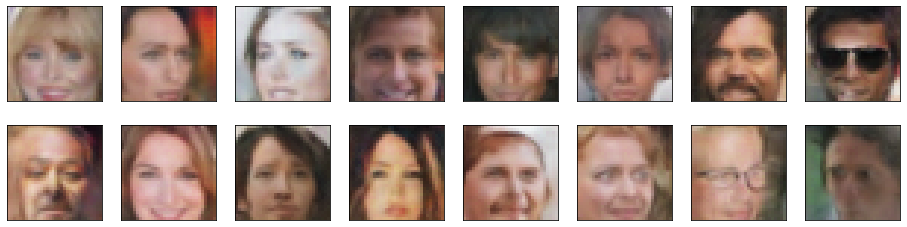

# Project Overview

In this project a Deep Convolutional Generative Adversarial Networks (DGAN) is developed in order to generate "face" celebrity faces.

The best results results were achieved with 4 layer Discriminator and Generator with layer depths of 64.

A sample of the results can be seen here:




### Project instructions

Please download the learning data from [here](https://s3.amazonaws.com/video.udacity-data.com/topher/2018/November/5be7eb6f_processed-celeba-small/processed-celeba-small.zip) and extract the data into `processed_celeba_small` folder. In alternative uncomment and run the first line in the jupyter notebook:
```ipnbpython
!unzip processed_celeba_small.zip
```
Launch the jupyter notebook server with:
```ipnbpython
jupyter notebook dlnd_face_generation.ipynb
```
